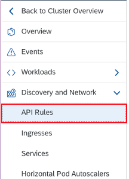

# Exercise 7 - BUILD AND DEPLOY CAP SERVICE

## Goal 🎯

The goal of this excercise is to deploy the CAP service to the Kyma runtime. This comprises three parts:

- A [_deployment_](https://kubernetes.io/docs/concepts/workloads/controllers/deployment/) of the CAP service as a pod in Kyma
- A [_service_](https://kubernetes.io/docs/concepts/services-networking/service/) to expose the CAP service as a network service
- An [_API rule_](https://kyma-project.io/docs/kyma/latest/05-technical-reference/00-custom-resources/apix-01-apirule) that exposes the CAP service endpoints to the internet

When exposing the CAP service we want to achieve that:

- The **orders** service should require the application's **User** scope due to the definition of **srv/orders-service.cds**. This requires the use of the Destination service to provide a token exchange.
- The external endpoint of the service is accessible to all

The deplyoment is declaratively defined in the **deployment.yaml** file. Depending on the previous setup choose the desired method for deployment. If the relating job ['cap-orders-service' was configured within the SAP CICD service](../ex3#exercise-351---cap-orders-service) then only the configuration of the helm chart is necessary, otherwise either the steps **7.2 - DEPLOYMENT OPTION 2 - kubectl** or **7.3 - DEPLOYMENT OPTION 3 - Helm** need to be followed.

## Docker Setup

To achive this we first need to make sure that the Docker image that we will build is deployed to the right registry:

- Open the file **/resources/service/Dockerfile** and replace **{your-docker-account}** with your Docker account id
- Save the changes

Now we have three options to trigger the deployment of the service that we outline in the next sections.

## Exercise 7.1 - DEPLOYMENT OPTION 1 - SAP CICD

In order to trigger the deployment via the SAP CICD service execute the following steps:

- Open the file **/resources/db/helm/cap-orders-service/values.yaml** and replace **{your-docker-account}** with your Docker account id
- Save the changes
- Commit the changes to your GitHub repository

The commit to your GitHub repository will trigger the SAP CICD service to start working on the pipeline. 

## Exercise 7.2 - DEPLOYMENT OPTION 2 - kubectl

In order to trigger the deployment via kubectl execute the following steps:

- Open the file **/resources/service/deployment.yaml** and replace the value of **{your-docker-account}** with your Docker account id
- Save the changes
- Build and push the Docker container of your CAP service via

  ```shell
  docker build -t {your-docker-account}/cap-orders-service -f ./resources/service/Dockerfile .

  docker push {your-docker-account}/cap-orders-service
  ```

- Apply the **deployment.yaml** file via kubectl. This generates the _deployment_, the _service_ and the _API Rule_ in one go.

  ```shell
  kubectl -n cap apply -f ./resources/service/deployment.yaml
  ```

## Exercise 7.3 - DEPLOYMENT OPTION 3 - Helm

In order to trigger the deployment via [Helm](https://helm.sh/) execute the following steps:

- Open the file **/resources/db/helm/cap-orders-service/values.yaml** and replace **{your-docker-account}** with your Docker account id
- Save the changes
- Install the Helm chart via

  ```shell
  helm install cap-orders-service ./resources/db/helm/cap-orders-service -n cap
  ```

## Result

The service will be accessible now via the url `https://cap-orders-service.<cluster url>`.

You can check also check settings of the API rule in the Kyma console. Navigate to the cap namespace. From there goto the `Discovery and Network -> API Rules` The rule has the name **cap-orders-service**


## Summary

🎉 Congratulations - You've now successfully deployed the CAP service to Kyma and exposed it via an API rule.

Continue to - [Exercise 8 - CONFIGURE LAUNCHPAD](../ex8/README.md)

[◀ Previous exercise](../ex6/README.md) | [🔼 Overview](../../README.md) | [Next exercise ▶](../ex8/README.md)
