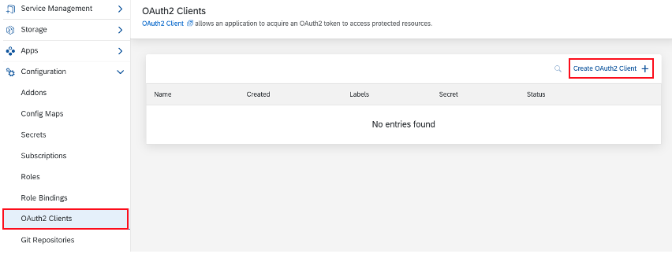
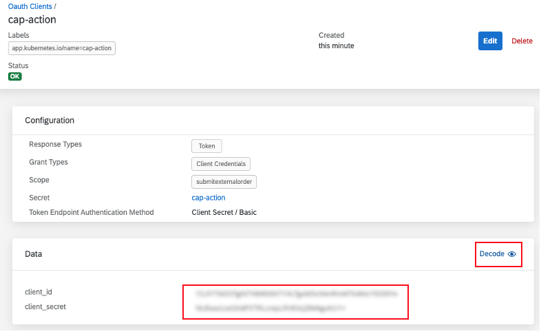

# Exercise 9 - REQUIRE OAUTH FOR THE ACTION

## Goal 🎯

As of now the the action **submitexternalorder**, exposed by the cap service using the path `/external`, is not requiring authentication. This is determined by the definition found in the file **components/srv/orders-service.cds**.

The goal of this exercise is to reconfigure the API rule in Kyma so that authentication via OAuth2 is necessary. This will be accomplished by leveraging the OAuth2 functionality delivered with Kyma.

## API Rule with OAuth2

First we change the configuration of the API rule that was applied, when we initially deployed the CAP service in [excercise 7](../ex7/README.md):

```yaml
apiVersion: gateway.kyma-project.io/v1alpha1
kind: APIRule
metadata:
  name: cap-orders-service
spec:
  gateway: kyma-gateway.kyma-system.svc.cluster.local
  rules:
    - accessStrategies:
        - config: {}
          handler: noop
      methods:
        - GET
        - POST
        - PUT
        - PATCH
        - DELETE
        - HEAD
      path: /.*
  service:
    host: cap-orders-service
    name: cap-orders-service
    port: 4004
```

The handler of the access strategies points is `noop`, so no authentication mechanism will be invoked. We will changes this now via the prepared yaml file **/resources/service/apirule-external.yaml**. Inspecting the file you will see that there is a dedicated section to enforce authentication via OAuth2 for the route `/external/*`:

```yaml
- accessStrategies:
    - config:
        required_scope:
        - submitexternalorder
      handler: oauth2_introspection
    methods:
    - POST
    path: /external/.*
```

You can also see that the required scope is defined as `submitexternal order`.

Apply this change via:

```shell
kubectl -n cap apply -f ./resources/service/apirule-external.yaml
```

Let us validate that the change is effective by issuing a POST request to the endpoint:

- In shell

  ```shell
  curl -X POST https://cap-orders-service.<cluster url>/external/submitorder -H 'Content-Type: application/json' -d '{"orderNo": 123123}'
  ```

- In PowerShell

  ```powershell
  curl.exe '-X' 'POST' 'https://cap-orders-service.<cluster url>/external/submitorder' '-H' 'Content-Type: application/json' '-d' '{\"orderNo\": 123123}'
  ```

This result in an error due to missing authentication. To overcome this we will set up an OAuth client in Kyma that provides the needed credentials to execute the call successfully.

## OAuth Client in Kyma

Let us create the OAuth client in Kyma and retrieve the needed credentials:

- Within the Kyma console go to **Configuration -> OAuth Clients**

  

- Choose **Create OAuth Client** and enter the following

  - Name: `cap-action`
  - Response types: `Token`
  - Grant types: `Client credentials`
  - Scope: `submitexternalorder`
  - Press the **Create** button

    

After the creation you will be forewarded to the overview screen of the newly created OAuth client. On this screen in the section **Secret cap-action** press the action **Decode** and copy the decoded values for Client ID and Client Secret



To get a valid token for the call to the endpoint of the **submitorder** action we must first retrive the token making use of the credentials we have just copied. To be able to do so we must first _encode_ them in base64 in the format `<client id>:<client secret> `.

You have the following options to do the encoding:

- Encode the credentials using https://www.base64encode.org/
- Encode the credentials using shell via

  ```shell
  echo -n <client id>:<client secret> | base64
  ```

- Encode the credentials using PowerShell via

  ```powershell
  [convert]::ToBase64String([System.Text.Encoding]::UTF8.GetBytes('<client id>:<client secret>'))
  ```

Copy the encoded result. We will use it now to get a valid access token for our call. We do so by sending a POST request to the OAuth token endpoint.

- In shell we do the following call:

  ```shell
  curl --location --request POST 'https://oauth2.<cluster url>/oauth2/token' \
  --header 'Authorization: Basic <encoded client id and secret>' \
  --form 'grant_type="client_credentials"' \
  --form 'scope="submitexternalorder"'
  ```

- In PowerShell we do the following call

  ```powershell
  curl.exe '--location' '--request' 'POST' 'https://oauth2.<cluster url>/oauth2/token' `
  '--header' 'Authorization: Basic <encoded client id and secret>' `
  '--form' 'grant_type=\"client_credentials\"' `
  '--form' 'scope=\"submitexternalorder\"'
  ```

This will return a value like:

```json
{"access_token":"HepyeseeOK1e33KymadaoKHtMmPllisa6CMACW0PjjSjQc.oZ08v_9gvNM17CoolSL3lFlYcX8z-HT7i7cG_rq1vapGGk","expires_in":3599,"scope":"submitexternalorder","token_type":"bearer"}%
```

Copy the value of the **access_token** as this will be needed in the call to the **external/submitorder** endpoint. Let's do that:

- In shell

  ```shell
  curl -X POST https://cap-orders-service.<cluster url>/external/submitorder -H 'Content-Type: application/json' -H 'Authorization: Bearer <access_token>' -d '{"orderNo": 123123}'
  ```

- In PowerShell

  ```powershell
  curl.exe '-X' 'POST' 'https://cap-orders-service.<cluster url>/external/submitorder' '-H' 'Content-Type: application/json' '-H' 'Authorization: Bearer <access_token>' '-d' '{\"orderNo\": 123123}'
  ```

This call is now sucessfully authenticated due to the provided access token, but will fail with the error `an error occurred...`. This occurrs due to the **MOCK_HOST** of the **components/src/orders-service.js** not being defined. Utlizing the logs you will also find that the call to the **Alert Notification** service fails too. This will be resolved in the next exercises.

## Summary

🎉 Congratulations - You've now secured your `submitorder` action via OAuth2 and accessed the endpoint leveraging the OAuth2 client of Kyma

Continue to - [Exercise 10 - SAP ALERT NOTIFICATION CONFIGURATION](../ex10/README.md)

[◀ Previous exercise](../ex8/README.md) | [🔼 Overview](../../README.md) | [Next exercise ▶](../ex10/README.md)
